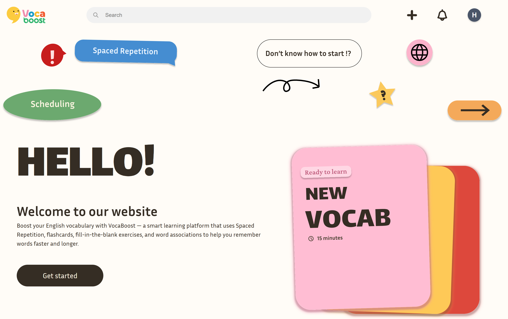
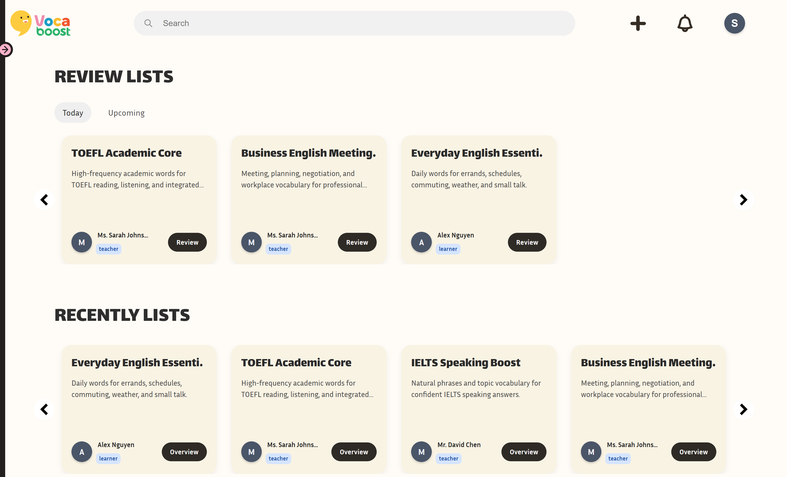
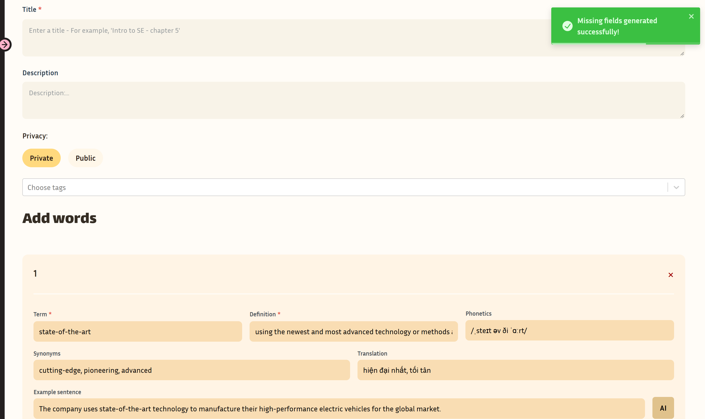
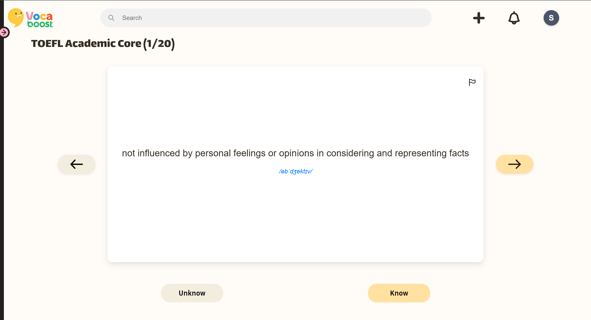
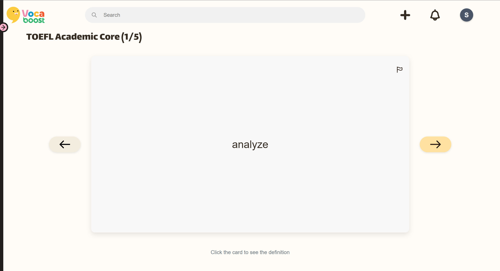
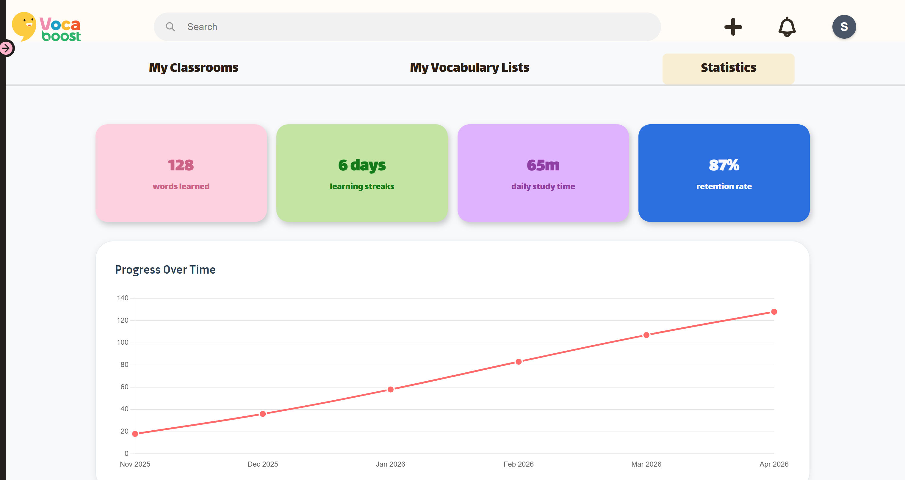
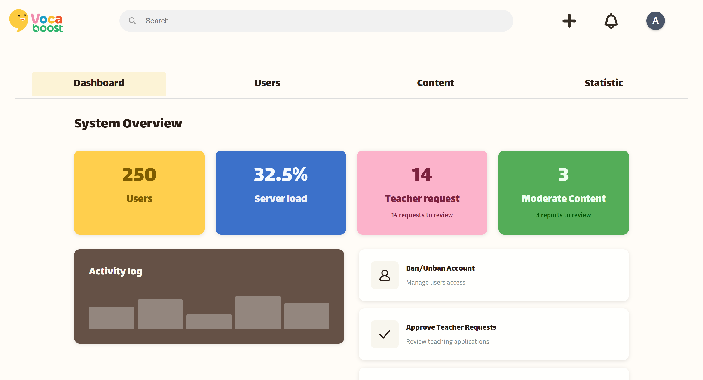
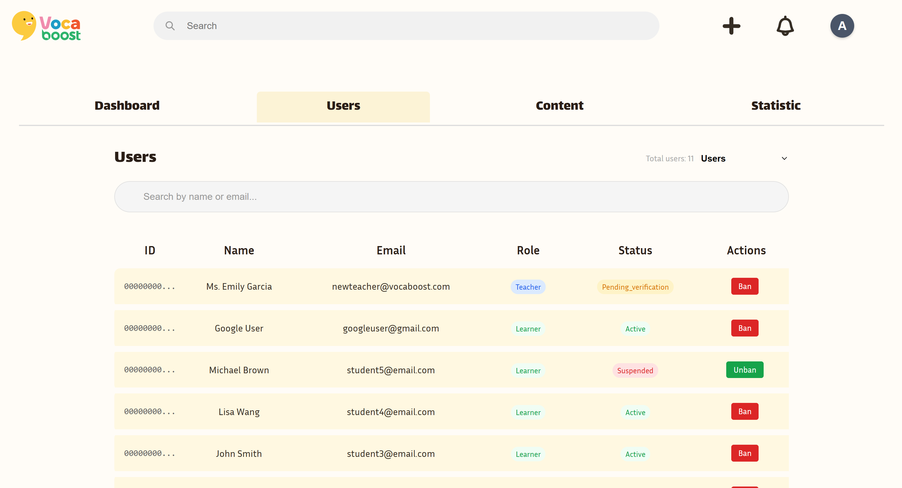
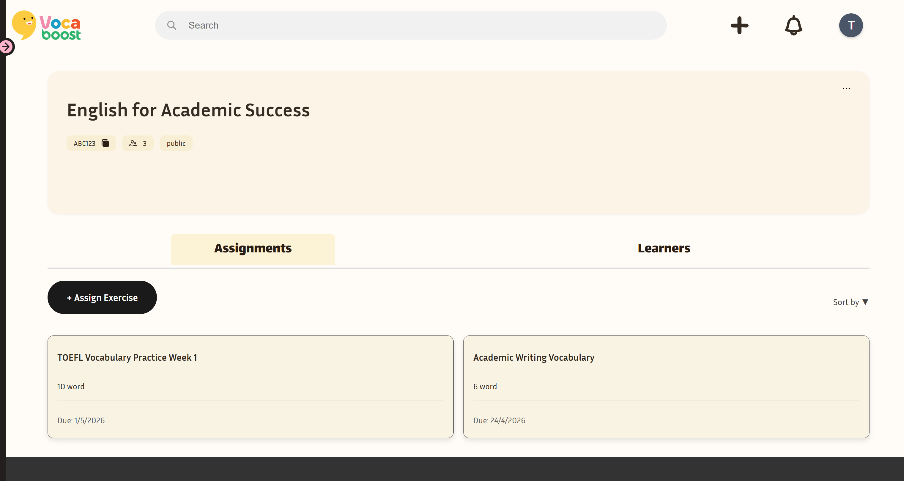

<div align="center">
  <h1>VocaBoost</h1>
  <p><strong>A full-stack vocabulary learning platform for self-study, spaced repetition, classroom assignments, and admin moderation.</strong></p>
  <p>
    <a href="https://www.youtube.com/playlist?list=PLKJnrG_tiSF7WdhYOtgO--JE7kraUeq9a"><strong>Watch the 6-part demo playlist</strong></a>
  </p>
  <p>
    
    
    
    
    
    
    
    
  </p>
  
</div>

## Overview

VocaBoost helps learners collect vocabulary, review words with structured practice modes, and track progress over time. It also supports teacher-led classrooms, assignments, learner progress review, account management, and admin moderation.

The project is built as a production-style split application: a React 19 + Vite single-page app, an Express 5 API, Supabase for database and storage, Gmail SMTP for account emails, and Google Gemini for AI-assisted vocabulary helpers.

## At A Glance

| Area | Details |
| --- | --- |
| Product | Vocabulary learning, review, classroom workflow, and moderation platform |
| Demo | [YouTube demo playlist](https://www.youtube.com/playlist?list=PLKJnrG_tiSF7WdhYOtgO--JE7kraUeq9a) |
| Roles | Learner, teacher, admin |
| Frontend | React 19, Vite, React Router, Axios, SCSS, Chart.js |
| Backend | Express 5, Supabase JS, JWT, Passport Google OAuth, Nodemailer, Handlebars |
| Database | Supabase migrations and demo seed data under `backend/supabase/` |
| Deployment target | Separate Vercel frontend and backend deployments |

## Product Highlights

- **Learner dashboard**: review due lists, resume practice, revisit recent lists, and discover popular public vocabulary.
- **Vocabulary builder**: create and edit lists with words, translations, examples, synonyms, tags, and privacy settings.
- **Review modes**: study with spaced-repetition scheduling, flashcards, fill-in-the-blank practice, batch summaries, and final summaries.
- **Learning analytics**: visualize learner progress through monthly activity, review outcomes, and vocabulary growth.
- **Classroom workflow**: teachers create classrooms, invite or approve learners, assign vocabulary work, and monitor progress.
- **Account and role management**: email/password login, Google OAuth, verification emails, password reset, teacher verification, and account status controls.
- **Admin moderation**: review teacher requests, manage user reports, suspend or restore accounts, and inspect platform statistics.
- **AI assistance**: generate example sentences and fill missing vocabulary fields with Google Gemini.

## Screenshots

<p align="center">
  
  
</p>

<p align="center">
  
  
</p>

<p align="center">
  
  
</p>

<p align="center">
  
  
</p>

## Demo Accounts

After loading the Supabase seed data, these accounts are available for local or disposable demo environments. All use the password `password`.

| Role | Email | Useful for |
| --- | --- | --- |
| Admin | `admin@vocaboost.com` | Admin dashboard, moderation, user management |
| Teacher | `teacher1@vocaboost.com` | Classrooms, assignments, learner progress |
| Learner | `student1@email.com` | Learner dashboard, vocabulary, review sessions |
| Learner | `learner@vocaboost.com` | Statistics-heavy learner demo data |

## Run Locally

VocaBoost has separate frontend and backend apps, so install dependencies in each folder.

```bash
cd backend
npm install
cp .env.example .env
npm run dev
```

The backend runs from `backend/server.js` and defaults to `http://localhost:3000`.

```bash
cd frontend
npm install
cp .env.example .env
npm run dev
```

Vite usually serves the frontend at `http://localhost:5173`.

For the complete setup flow and environment variable notes, see [docs/setup-and-run.md](docs/setup-and-run.md).

## Load Demo Data

Supabase migrations and seeds live in `backend/supabase/`. For a disposable linked Supabase project:

```bash
cd backend
npx supabase db reset --linked
```

For a local Supabase stack:

```bash
cd backend
npx supabase db reset --local
```

The seed config loads `seed.sql` first and `seed_statistics.sql` second, so dashboard, review, admin, and statistics screens have demo-ready data.

## Environment

Backend configuration lives in [backend/.env.example](backend/.env.example) and covers server settings, Supabase keys, JWT secrets, Gmail SMTP, Google OAuth, and Gemini.

Frontend configuration lives in [frontend/.env.example](frontend/.env.example):

- `VITE_API_BASE_URL`
- `VITE_GOOGLE_AUTH_URL`

Do not commit real API keys, Supabase service keys, OAuth secrets, or SMTP credentials.

## Validation

Backend:

```bash
cd backend
npm test
npm run test:preview
```

Frontend:

```bash
cd frontend
npm run build
npm run lint
```

## Deployment

VocaBoost is designed for two Vercel deployments:

- `backend/`: Express API exposed through `backend/api/index.js`
- `frontend/`: Vite static build from `frontend/dist`

Deployment checks:

- `FRONTEND_URL` must match the deployed frontend URL.
- `VITE_API_BASE_URL` must point to the deployed backend API.
- Google OAuth callback URLs must match the backend deployment.
- After deployment, smoke-check `GET /health`, sign-in, token refresh, email links, dashboard loading, and core navigation.

See [docs/deployment.md](docs/deployment.md) for the full deployment notes.

## Repository Layout

```
VocaBoost/              
│
├── backend/          Express API, services, tests, Supabase config
├── frontend/         React SPA, routes, services, hooks, SCSS
├── images/           README screenshots and product visuals
├── docs/             Canonical technical documentation
├── pa/               Archived course deliverables
└── README.md              
```

## Documentation Map

- [docs/README.md](docs/README.md): documentation index and source-of-truth rules
- [docs/architecture.md](docs/architecture.md): system architecture overview
- [docs/frontend-architecture.md](docs/frontend-architecture.md): frontend routes, providers, API client, and styling
- [docs/backend-architecture.md](docs/backend-architecture.md): backend route, controller, service, model, and middleware structure
- [docs/database.md](docs/database.md): Supabase schema, migrations, and data behavior
- [docs/auth-and-roles.md](docs/auth-and-roles.md): authentication, account status, and authorization model
- [docs/API contracts/README.md](docs/API%20contracts/README.md): API contract index
- [docs/testing.md](docs/testing.md): validation and testing expectations
- [docs/troubleshooting.md](docs/troubleshooting.md): common local setup and runtime fixes

## Known Notes

- The current public demo is a recorded YouTube playlist. Add the live app URL here when the deployed frontend is public.
- Supabase, SMTP, Google OAuth, and Gemini features require real environment variables.
- `docs/` and `pa/` include archived academic deliverables that may describe older project states; canonical docs and source files should be treated as the implementation authority.
- The vocabulary image-upload route is documented as an implementation gap until the matching storage helper is completed.

## Course Context

This repository was created for HCMUS `CSC13002 - Introduction to Software Engineering`, class `23CLC06`, group `06`.

| Student ID | Full name | Email |
| --- | --- | --- |
| 23127048 | Phan The Hoang | pthoang23@clc.fitus.edu.vn |
| 23127194 | Nguyen Hoang Phi Hung | nhphung23@clc.fitus.edu.vn |
| 23127224 | Nguyen Le Truc Mai | nltmai23@clc.fitus.edu.vn |
| 23127305 | Nguyen Hiep Thang | nhthang23@clc.fitus.edu.vn |
| 23127436 | Phan Hoang Quang Nghi | phqnghi23@clc.fitus.edu.vn |
